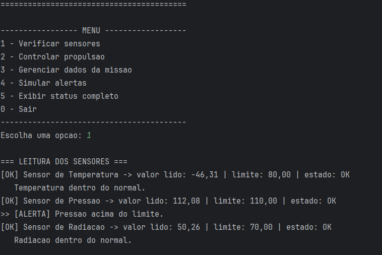
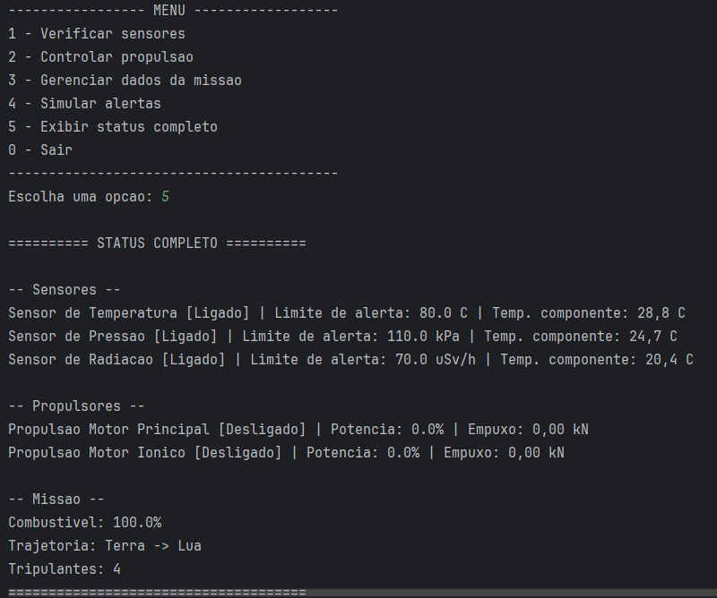

# 🚀 Plataforma de Monitoramento de Sistemas Espaciais

Projeto da **Global Solution 2026 — Programação Orientada a Objetos (POO)**.

Uma plataforma de monitoramento de uma estação espacial: acompanha sensores, controla
sistemas de propulsão, protege os dados da missão e emite alertas automáticos quando
algo sai dos limites de segurança.

## 👨‍🚀 Integrantes

| Nome | RM |
|------|----|
| Nelson Troccoli Santos Neto | RM562815 |
| Kauã da Silva Lazarim | RM564625 |

## 🎯 Sobre o projeto

O sistema simula o monitoramento de uma estação espacial através de um **menu interativo
no console**. A partir dele é possível:

- Ler valores dos sensores (temperatura, pressão e radiação)
- Ligar/desligar e acelerar os motores de propulsão
- Gerenciar os dados da missão (protegidos por código de acesso)
- Simular alertas e falhas de sensores
- Exibir o status completo da estação

## 🧩 Conceitos de POO aplicados

| Conceito | Onde está | Como foi aplicado |
|----------|-----------|-------------------|
| **Classe Abstrata** | `ComponenteEspacial` | Classe `abstract` com atributos comuns (`id`, `nome`, `status`, `temperatura`), métodos concretos (`ligar`/`desligar`) e o método abstrato `exibirStatus()`. |
| **Interface** | `Sensor` | Contrato implementado por 3 sensores diferentes (`implements`). |
| **Encapsulamento** | `DadosMissao` | Atributos `private`, coordenadas protegidas por senha, getters/setters com validação e alerta automático de combustível. |
| **Herança** | `SistemaPropulsao` | Classe abstrata estendida por `PropulsaoQuimica` e `PropulsaoEletrica`, com `acelerar()` sobrescrito usando `super()`. |
| **Polimorfismo** | `SistemaMonitoramento` | Listas de `Sensor` e de `SistemaPropulsao` tratadas de forma genérica. |

## 📁 Estrutura dos arquivos

```
GS - POO/
└── src/
    ├── model/
    │   ├── ComponenteEspacial.java   (classe abstrata)
    │   ├── Sensor.java               (interface)
    │   ├── DadosMissao.java          (encapsulamento)
    │   ├── SistemaPropulsao.java     (classe abstrata)
    │   ├── PropulsaoQuimica.java     (herda de SistemaPropulsao)
    │   ├── PropulsaoEletrica.java    (herda de SistemaPropulsao)
    │   ├── SensorTemperatura.java    (implementa Sensor)
    │   ├── SensorPressao.java        (implementa Sensor)
    │   └── SensorRadiacao.java       (implementa Sensor)
    └── main/
        └── SistemaMonitoramento.java (classe principal com menu)
```

## 🛠️ Funcionalidades

### Sensores
- Leitura de valores simulados (aleatórios)
- Verificação de funcionamento (com possibilidade de simular falha)
- Limites de alerta configuráveis e detecção quando o valor ultrapassa o limite

### Propulsão
- Ligar/desligar motores
- Acelerar com potência de **0 a 100%** (com validação)
- Cálculo de empuxo (diferente para cada tipo de propulsão)

### Dados da Missão
- Coordenadas protegidas por **código de acesso**
- Nível de combustível com validação e **alerta automático abaixo de 20%**
- Trajetória e número de tripulantes

### Sistema de Alertas
Verifica os sensores automaticamente e classifica em **3 níveis**:

- 🟡 **ATENÇÃO** — valor a partir de 90% do limite
- 🟠 **ALERTA** — valor acima do limite
- 🔴 **CRÍTICO** — valor muito acima do limite (>120%) ou sensor em falha

## 🖼️ Demonstração

Sistema em execução no console:

**Verificação de sensores e alertas**



**Status completo da estação**



## ▶️ Como executar

Requisito: **JDK 8 ou superior** (desenvolvido e testado no JDK 21).

### Pela linha de comando

```bash
# A partir da raiz do projeto:
javac -d out src/model/*.java src/main/*.java
java -cp out main.SistemaMonitoramento
```

### Pela IDE (IntelliJ IDEA)

Abrir o projeto e executar a classe `main.SistemaMonitoramento`.

## 🖥️ Exemplo de uso

```
=========================================
  PLATAFORMA DE MONITORAMENTO ESPACIAL
=========================================

----------------- MENU ------------------
1 - Verificar sensores
2 - Controlar propulsao
3 - Gerenciar dados da missao
4 - Simular alertas
5 - Exibir status completo
0 - Sair
-----------------------------------------
Escolha uma opcao: 1

=== LEITURA DOS SENSORES ===
[OK] Sensor de Temperatura -> valor lido: 12.98 | limite: 80.00 | estado: OK
   Temperatura dentro do normal.
[OK] Sensor de Pressao -> valor lido: 101.94 | limite: 110.00 | estado: OK
>> [ATENCAO] Pressao proximo do limite.
[OK] Sensor de Radiacao -> valor lido: 81.21 | limite: 70.00 | estado: OK
>> [ALERTA] Radiacao acima do limite.
```
